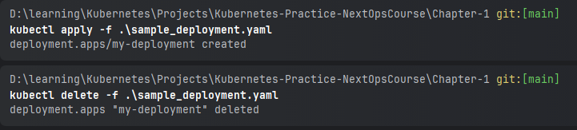

### Pod 

Get All Pods Command:
```shell
kubectl get all -A
kubectl get deployments
kubectl get replicasets
kubectl apply -f .\sample_deployment.yaml
kubectl delete -f .\sample_deployment.yaml
kubectl apply -f .\sample_pod.yaml
kubectl get pods
```





