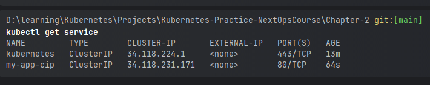
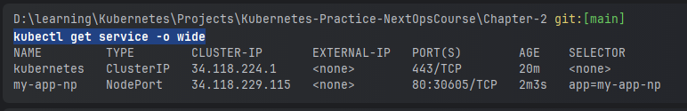
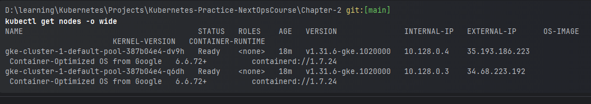
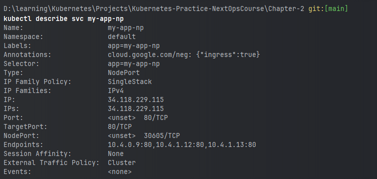

### Chapter - 2

```shell

kubectl get pods -o wide
kubectl apply -f .
kubectl get service
kubectl get nodes -o wide
kubectl get service -o wide
gcloud compute firewall-rules list
kubectl get nodes -w -o wide
```




