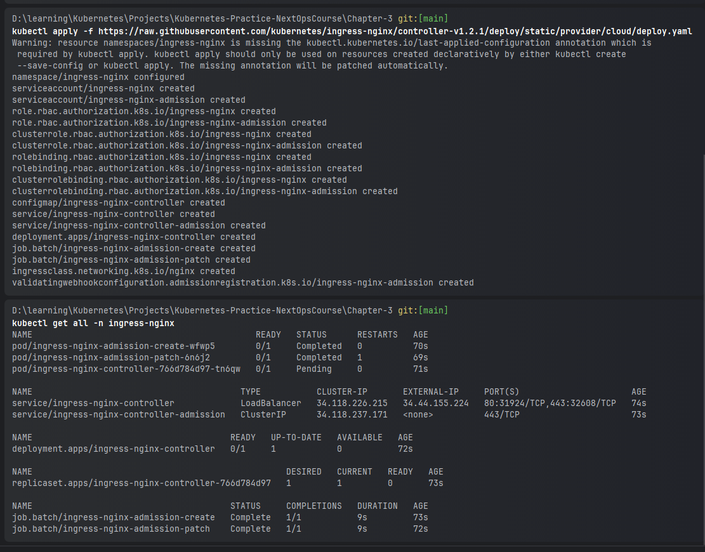

### Ingress Controller & Resources

```powershell
#create namespace
kubectl create namespace ingress-nginx
#to run ingress controller all components
kubectl apply -f https://raw.githubusercontent.com/kubernetes/ingress-nginx/controller-v1.2.1/deploy/static/provider/cloud/deploy.yaml
kubectl get ingress
kubectl delete -A ValidatingWebhookConfiguration ingress-nginx-admission
kubectl apply -f sample_ingress_dep_one.yaml
kubectl apply -f sample_ingress_dep_two.yaml
kubectl apply -f sample_ingress_resource.yaml
kubectl get service -n ingress-nginx
curl http://10.106.144.114:80
curl http://10.106.144.114:80/nginx
curl http://10.106.144.114:80/httpd

```

