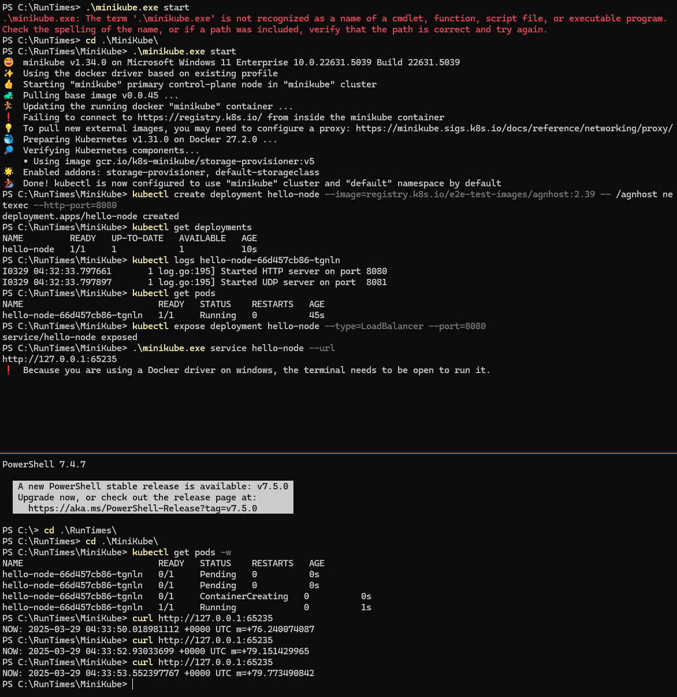

### Minikube Commands

```powershell
.\minikube.exe start
.\minikube.exe stop
kubectl create deployment hello-node --image=registry.k8s.io/e2e-test-images/agnhost:2.39 -- /agnhost netexec --http-port=8080
kubectl get deployments
kubectl config view
kubectl logs hello-node-5f76cf6ccf-br9b5
kubectl get pods
kubectl expose deployment hello-node --type=LoadBalancer --port=
.\minikube.exe service hello-node --url
```

